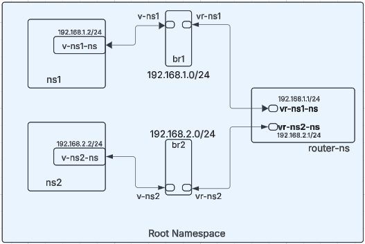
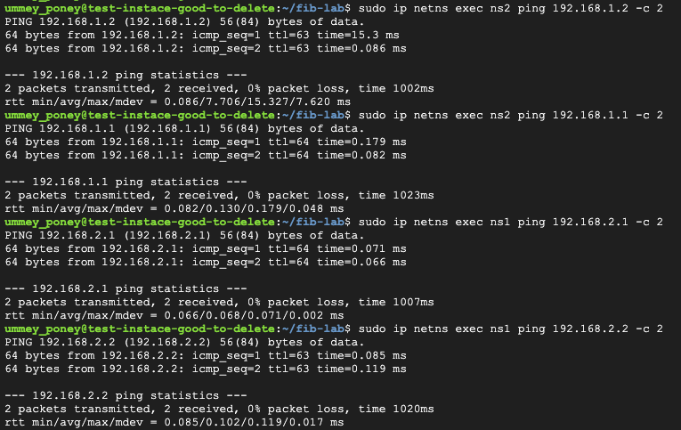
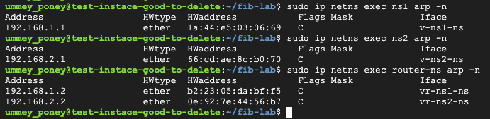

# Linux Network Namespace Simulation Assignment

## Main Objective: 
We are going to create a network simulation with two separate networks connected via a router using Linus network namespaces and bridges. 

## Network Topology
 \
Let's breakdown the objective into smaller tasks and accomplish the simulation. 

## Tasks

We will start with system readiness and install the tools that we may (or may not) need to verify connectivity.

### 1. Install system pre-requisites

```
sudo apt update && sudo apt upgrade -y
sudo apt install iproute2 net-tools tcpdump -y
sudo apt install build-essential
```

### 2. Create network bridges
We are going to create br1 and br2 virtual bridges. Router namespaces will connect to two different namespaces using these 2 bridges. 

```
sudo ip link add br1 type bridge
sudo ip link add br2 type bridge
```
Make sure the bridges are up to be operational. 
```
sudo ip link set br1 up
sudo ip link set br2 up
```
Verify that the bridges have been created and turned "up" using `sudo ip link list` command which will show an output similar to the following.
```
<<<<<<<<< Output omitted >>>>>>>>>

2: ens4: <BROADCAST,MULTICAST,UP,LOWER_UP> mtu 1460 qdisc mq state UP mode DEFAULT group default qlen 1000
    link/ether 42:01:0a:80:0f:d9 brd ff:ff:ff:ff:ff:ff
    altname enp0s4
34: br1: <NO-CARRIER,BROADCAST,MULTICAST,UP> mtu 1500 qdisc noqueue state DOWN mode DEFAULT group default qlen 1000
    link/ether 5a:3b:a5:2b:4c:37 brd ff:ff:ff:ff:ff:ff
35: br2: <NO-CARRIER,BROADCAST,MULTICAST,UP> mtu 1500 qdisc noqueue state DOWN mode DEFAULT group default qlen 1000
    link/ether e2:4c:1b:da:30:54 brd ff:ff:ff:ff:ff:ff
```
### 3. Create network namespaces
We are going to create three network namespaces - ns1, ns2 and router-ns. 
```
sudo ip netns add ns1
sudo ip netns add ns2
sudo ip netns add router-ns
```
Check and confirm using `sudo ip netns list` command. 
```
ummey_poney@test-instace-good-to-delete:~/fib-lab$ sudo ip netns list
router-ns
ns2
ns1
```
### 4. Create virtual interfaces and connections
First we are going to create 4 virtual ethernet links. These veth link pairs are:\
`v-ns1-ns` in ns1 <---- to ---> `v-ns1` in br1 \
`vr-ns1-ns` in router-ns <---- to ---> `vr-ns1` in br1 \
\
`v-ns2-ns` in ns2 <---- to ---> `v-ns2` in br2 \
`vr-ns2-ns` in router-ns <---- to ---> `vr-ns2` in br2 \
```
sudo ip link add v-ns1-ns type veth peer name v-ns1
sudo ip link add vr-ns1-ns type veth peer name vr-ns1
sudo ip link add v-ns2-ns type veth peer name v-ns2
sudo ip link add vr-ns2-ns type veth peer name vr-ns2
```
You can see the newly created veth interfaces using `sudo ip link list`. Now we want to attach the interfaces with the bridges and namespaces.
```
sudo ip link set v-ns1-ns netns ns1
sudo ip link set v-ns2-ns netns ns2
sudo ip link set vr-ns1-ns netns router-ns
sudo ip link set vr-ns2-ns netns router-ns
sudo ip link set v-ns1 master br1
sudo ip link set vr-ns1 master br1
sudo ip link set v-ns2 master br2
sudo ip link set vr-ns2 master br2
```
At this point, as we are in the root namespace we will see only the veth interfaces that were attached to br1 and br2. The rest of the veth interfaces are available in their respective namespaces. Before moving on to the next task let's not forget to turn the veth interfaces attached to the bridges up. Verify using `sudo ip link list`. 
```
sudo ip link set v-ns1 up
sudo ip link set vr-ns1 up
sudo ip link set v-ns2 up
sudo ip link set vr-ns2 up
```
### 5. Configure IP Addresses
As mentioned in the topology, we are going to assign IP addresses from 192.168.1.0/24 network to veth interfaces in ns1 and router-ns. For ns2 and router-ns connectivity we are going to use 192.168.2.0/24 network. 
```
sudo ip netns exec ns1 ip link set v-ns1-ns up
sudo ip netns exec ns1 ip addr add 192.168.1.2/24 dev v-ns1-ns
```
```
sudo ip netns exec ns2 ip link set v-ns2-ns up
sudo ip netns exec ns2 ip addr add 192.168.2.2/24 dev v-ns2-ns
```
```	
sudo ip netns exec router-ns ip link set vr-ns1-ns up
sudo ip netns exec router-ns ip addr add 192.168.1.1/24 dev vr-ns1-ns
sudo ip netns exec router-ns ip link set vr-ns2-ns up
sudo ip netns exec router-ns ip addr add 192.168.2.1/24 dev vr-ns2-ns
```
### 6. Setup routing
Now, we want to configure the default routes within ns1 and ns2 namespaces. This routing information will allow the veth interfaces in these namespaces to forward traffic through correct interface.
```
sudo ip netns exec ns1 ip route add default via 192.168.1.1
sudo ip netns exec ns2 ip route add default via 192.168.2.1
```
At this point we need to make sure IP forwarding is enabled. If not, we can use the command mentioned below. IP forwarding is crucial when we want the system to act as router and forward traffic across different networks. An important point to note here, the change made by this command is not persistent across reboots. For persistence, we can edit the system file `/etc/sysctl.conf` or `/etc/sysctl.d` to add `net.ipv4.ip_forward=1`. This setting will be applied automatically when the system starts. 
```
sudo sysctl -w net.ipv4.ip_forward=1
```
Check and verify the default routes in the namespaces using `sudo ip netns exec <namespace-name> route`. 

```
ummey_poney@test-instace-good-to-delete:~/fib-lab$ sudo ip netns exec ns1 route
Kernel IP routing table
Destination     Gateway         Genmask         Flags Metric Ref    Use Iface
default         _gateway        0.0.0.0         UG    0      0        0 v-ns1-ns
192.168.1.0     0.0.0.0         255.255.255.0   U     0      0        0 v-ns1-ns
ummey_poney@test-instace-good-to-delete:~/fib-lab$ sudo ip netns exec ns2 route
Kernel IP routing table
Destination     Gateway         Genmask         Flags Metric Ref    Use Iface
default         _gateway        0.0.0.0         UG    0      0        0 v-ns2-ns
192.168.2.0     0.0.0.0         255.255.255.0   U     0      0        0 v-ns2-ns
ummey_poney@test-instace-good-to-delete:~/fib-lab$ sudo ip netns exec router-ns route
Kernel IP routing table
Destination     Gateway         Genmask         Flags Metric Ref    Use Iface
192.168.1.0     0.0.0.0         255.255.255.0   U     0      0        0 vr-ns1-ns
192.168.2.0     0.0.0.0         255.255.255.0   U     0      0        0 vr-ns2-ns
ummey_poney@test-instace-good-to-delete:~/fib-lab$
```
### 7. Enable and Test Connectivity
Now we want to test connectivity using by pinging from veth interface to veth interfaces in router-ns and ns2 namespaces.


Similarly, successful ping will indicate that veth interfaces of router-ns and ns1 are also able to connect with veth interfaces of ns2 namespace. 

Let's take a look at the arp table for these namespaces. ARP table shows the mapping between the IP Addresses and MAC addresses for interfaces. 


It is important to note that when I was using poridhi lab environment for the assignment, I had to add firewall rule into the host system's IP Tables to establish connectivity and get successfull ICMP reply messages. I added the following FW rules: 
```
sudo iptables --append FORWARD --in-interface br1 --jump ACCEPT
sudo iptables --append FORWARD --out-interface br1 --jump ACCEPT
sudo iptables --append FORWARD --in-interface br2 --jump ACCEPT
sudo iptables --append FORWARD --out-interface br2 --jump ACCEPT
``` 
However, I did not need these FW rules when I tested in Google Compute Engine.

### 8. Clean up
At the end of the testing we want to do some cleanup. Using the following commands we can delete the namespaces and virtual interfaces. 
```
sudo ip netns del ns1
sudo ip netns del ns2
sudo ip netns del router-ns
sudo ip link del br1
sudo ip link del br2
```